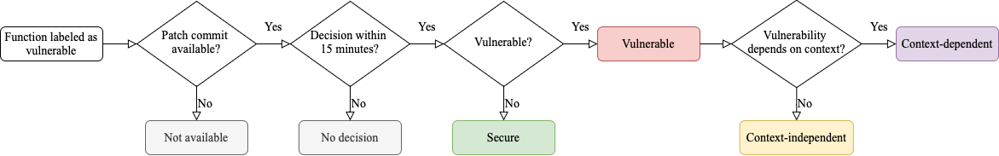

# Code, Data and Results for "Top Score on the Wrong Exam: On Benchmarking in Machine Learning for Vulnerability Detection"

## Setup

The json and csv files are stored with git-lfs. Install git-lfs using the official [tutorial](https://git-lfs.com) and run the following command from the root directory of this repository:

`git lfs pull`

## Citation

If you want to use our work, please use the following citation.

```
@misc{risse2024scorewrongexambenchmarking,
      title={Top Score on the Wrong Exam: On Benchmarking in Machine Learning for Vulnerability Detection},
      author={Niklas Risse and Marcel Böhme},
      year={2024},
      eprint={2408.12986},
      archivePrefix={arXiv},
      primaryClass={cs.CR},
      url={https://arxiv.org/abs/2408.12986},
}
```

## Structure

Below is an annotated map of the directory structure of this repository.

```
.

│
├── original_datasets...................... The original datasets that we used as a basis for our empirical study.
│   └── <dataset>.......................... One directory for each dataset (BigVul, Devign, DiverseVul).
│
├── raw_samples............................ The raw functions that we sampled for RQ1.
│   ├── <dataset>_sample.csv............... The 100 functions per dataset (labeled as vulnerable) that we used for RQ1 a + b.
│   └── <dataset>_secure_sample.csv........ The 30 functions per dataset (labeled as secure) that we used for RQ1 c.
│
├── labeled_samples........................ The functions + labels that we manually labeled for RQ1.
│   ├── <dataset>_labeled.csv.............. The 100 functions per dataset (labeled as vulnerable) that we labeled for RQ1 a + b.
│   └── <dataset>_secure_labeled.csv....... The 30 functions per dataset (labeled as secure) that we labeled for RQ1 c.
│
├── scripts................................ Scripts to exactly reproduce results presented in our paper.
│   ├── <dataset>_sample.py................ Script to exactly reproduce the raw samples from the original datasets.
│   └── spurious_correlations.py........... Script to reproduce the results for RQ2.
│
├── figures................................ All figures that we presented in our paper.
├── generate_figures.py.................... Script to generate all figures we presented in our paper.
│
├── install_requirements.sh................ Script to install Python environment and required packages.
├── requirements.txt....................... All Python packages that you need to run the experiments.
│
└── README.md
```

## Explanation of the Labeled Samples

The labels we produced for RQ1 can be found in the labeled_samples directory. For each of the samples, we preserved the column structure of the original datasets and appended additional columns. The most relevant **original** columns are the following:

1. The function code.
    - func (Devign)
    - func (DiverseVul)
    - func_before (BigVul)
2. The project repository name.
    - project (for all three datasets)
3. The patch commit id.
    - commit_id (for all three datasets)

For the 100 functions labeled as vulnerable for RQ1 a + b (labeled_samples/\<dataset\>\_labeled.csv), we added six new columns:

1. vulnerable: The vulnerability label we generated for RQ1a.
    - 0 for secure
    - 1 for vulnerable
2. vulnerable_explanation: Justification for the vulnerability label in natural language.
3. invalid_label_reason: If the vulnerability label did not match the original label, we provide a reason.
    - 0 for errors during patch commit identification
    - 1 for structural changes
    - 2 for unrelated changes (see paper).
4. context_dependence: If the function was actually vulnerable, we determined whether the vulnerability could be determined without additional context.
    - 0 for context-dependence
    - 1 for context-independence.
5. context_dependence_explanation: Justification for the context_dependence label in natural language.
6. context_dependence_reason: Type of context dependence we observed.
    - 1 for dependence on function arguments
    - 2 for dependence on external functions
    - 3 for dependence on type declarations
    - 4 for dependence on globals (macros or global variables)
    - 5 for dependence on execution environment

For the 30 functions labeled as secure for RQ1 c (labeled_samples/\<dataset\>\_secure_labeled.csv), we added one new column:

1. vulnerable_context: A context setting in which the function would be vulnerable described in natural language. If empty, we were unable to find such a context.

## Labeling Process

The following figure, which is also displayed in the paper, shows our labeling process. This process can be used to replicate labeling decisions.



## Setup for Python Scripts

### Step 1: Install Anaconda

Anaconda is an open-source package and environment management tool for Python. Instructions for Installation can be found [here](https://www.anaconda.com/products/distribution).

### Step 2: Install Requirements

We assume that you have Anaconda installed.

Running the following script from the root directory of this repository creates a virtual environment in Anaconda, and installs the required Python packages.

```
bash install_requirements.sh
```

Activate the environment with the following command.

```
conda activate PerfectScore
```

### Step 3: Ready to go
